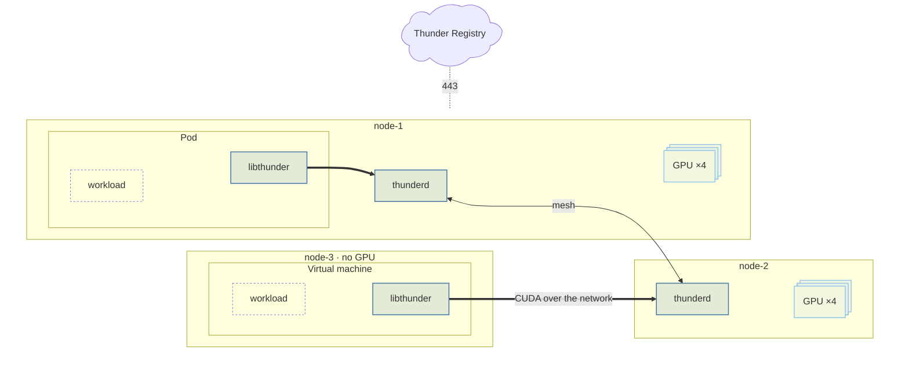

Thunder separates the machine that runs a workload from the machine that owns the
GPU. Three pieces make that work.

## Components

| Component | Runs on | Role |
| --- | --- | --- |
| `libthunder` | Client | Preloaded into the workload process. Intercepts CUDA calls and carries them to a GPU server over the network. |
| `thunderd` | Server | Runs on every GPU server. Joins the zone mesh, shares the state of its GPUs with its peers, and serves GPU traffic to clients. |
| Thunder Registry | Thunder-operated | The management API at `registry.thundercompute.com`. Registers servers and clients, issues and validates their credentials, and lets a client find the servers in its zone. |

Every machine runs the same mesh. `thunderd` sits on top of the GPUs it owns;
`libthunder` sits under the workload wherever that workload happens to run. A pod
on a GPU machine and a VM on a machine with no GPU reach the mesh the same way.

The Registry does registration, discovery, and authentication, and nothing else. It
does not choose GPUs, hold state about running workloads, or sit in the data path,
so a zone keeps working through a loss of connectivity to it. See
[Fault tolerance](/fault-tolerance).

## Zones

A zone is a single locality: a set of machines that can all reach each other over a
common IP range. In practice that is a data center, a row of racks, or a subnet.

Every `thunderd` in a zone gossips with every other `thunderd` in that zone, so all
of them share one view of the zone's GPUs. That mesh is what makes GPU placement a
local decision rather than a round trip to a control plane.

<Warning>
  The mesh assumes full reachability. The IP each node advertises must be reachable
  by every other node **and** by every client in the zone, on the Thunder port range.
  A node that only part of the zone can reach will not participate correctly.
</Warning>

Zones are also a performance boundary. The link inside a zone carries intercepted
CUDA calls, which is why the [requirements](/requirements) ask for round-trip latency
below `2 ms` and throughput above `5 Gbps` between machines in it.

A client is only ever matched to a GPU inside its own zone, and GPU traffic never
crosses a zone boundary. A fleet may contain many zones.

## Using a GPU

There is nothing to run per workload and nothing to change in the workload itself.
Once a client is enrolled, its configuration is written to `/etc/thunder/config.json`
and `libthunder` is registered as a preloaded library. From that point any process on
that machine that calls CUDA is served by Thunder, with no recompilation, no
containerization, and no code changes.

What happens behind that:

- When a workload first touches CUDA, `libthunder` asks the zone mesh for a GPU.
- The mesh selects the best one available, weighing network latency to the client
  and how heavily each GPU is already being used. The client gets a good GPU for
  *its* location, not simply the first free one.
- Once that selection is made, the data path is **fully direct**. CUDA traffic flows
  straight between the client and the server holding the GPU. Nothing sits in the
  middle: not the mesh, not the Registry.

Establishing this takes `50-100 ms`, which is why a GPU can be released and
reassigned between phases of a workload instead of being held for its whole
lifetime.

When the workload stops using CUDA, the GPU returns to the pool. If a client
disappears without shutting down cleanly, its server notices and reclaims the GPU on
its own, so a crashed workload cannot strand one.

## Ports

Clients open connections to servers; servers never dial clients.

| Path | Port | Purpose |
| --- | --- | --- |
| Client and server to the Registry | `443/tcp` (egress) | Enrollment, discovery, credential checks, heartbeat, telemetry |
| Server to server | `32000-32199/tcp` and `/udp` (ingress on servers) | The zone gossip mesh |
| Client to server | `32000-32199/tcp` and `/udp` (ingress on servers) | GPU selection and CUDA traffic |
| Client and server to `get.thundercompute.com` | `443/tcp` (egress) | Binary and package downloads |

The full list, including what each role needs, is in [Requirements](/requirements).
