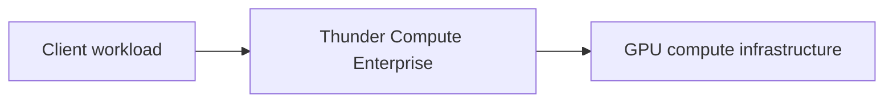

<Note>
  The diagram and subheadings on this page are placeholders for the full architecture documentation.
</Note>

## Architecture diagram

## Components

- A daemon on each physical server exposes its GPUs to workloads.
- A small shim library enables GPU access in each VM or container.

## GPU assignment

- One physical GPU is allocated to one workload at a time.
- The workload has exclusive access to the entire GPU.
- Access ends when all processes using CUDA have exited.
