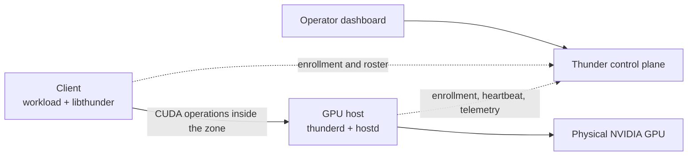

Thunder Compute Enterprise separates management traffic from GPU traffic. The control plane enrolls machines and distributes zone membership; workload-to-GPU communication stays within the customer's zone.

## Control plane

The control plane maintains organizations, zones, enrollment credentials, host and client records, and the active host roster. Hosts periodically register and check in. The control plane does not sit in the CUDA data path.

## Host

Every GPU server runs `thunderd` as a systemd service. It maintains the host's zone membership, discovers peers, reports health, and supervises the host-side GPU services. `hostd` accepts client requests and owns the lifecycle of the GPU-serving sessions on that machine.

## Client

The client runs the workload together with `libthunder`. The library intercepts supported CUDA driver operations, discovers an assigned host, and forwards the operations over the zone network. Application source code does not need to know which physical server owns the GPU.

## GPU assignment

One physical GPU is assigned exclusively to one workload at a time. Thunder can admit more workloads than physical GPUs, but a workload may wait when all compatible GPUs are busy. After the workload releases its CUDA resources or exits, its GPU can return to the available pool.

## Zone boundary

Hosts exchange discovery and coordination traffic only with peers in their zone. Clients connect only to hosts in their zone. A fleet may contain several zones, but Thunder does not forward CUDA traffic between them.

See the [glossary](/glossary) for component and credential definitions.
